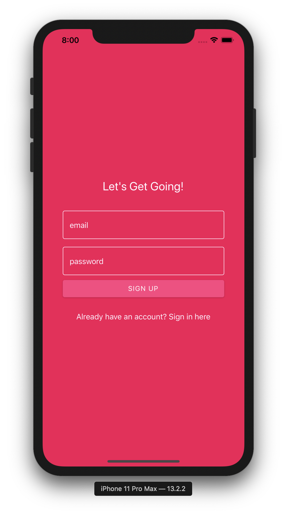
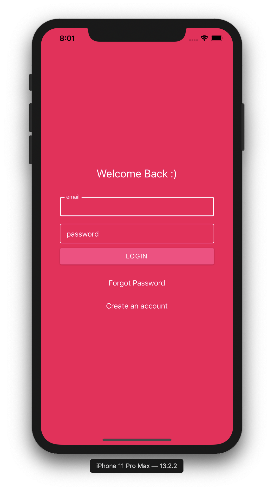
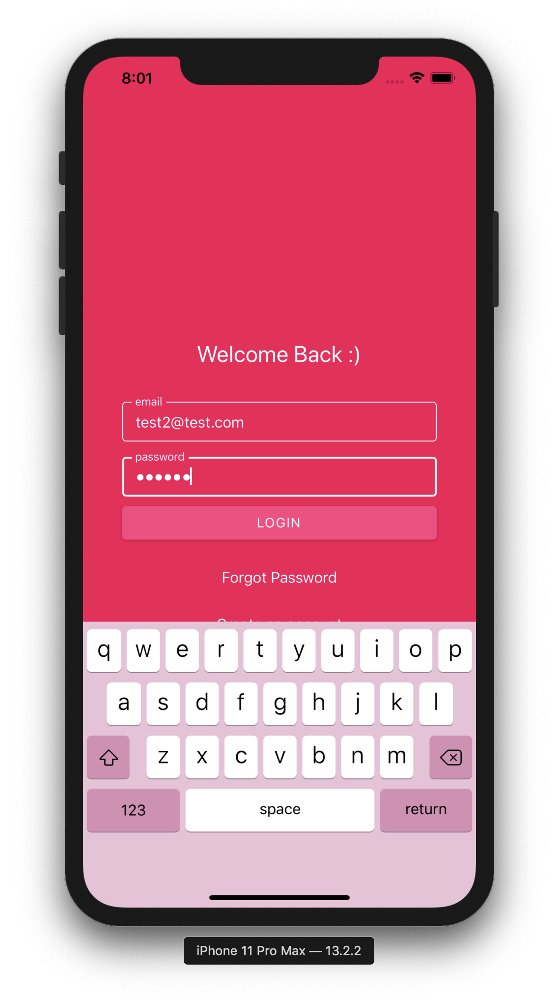
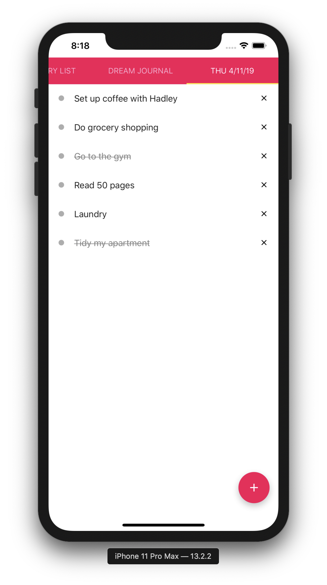
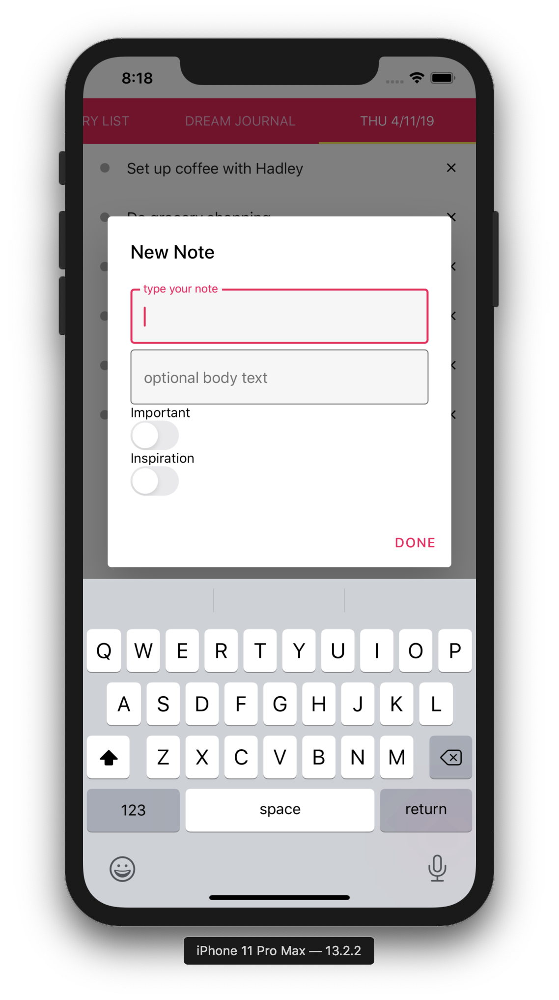
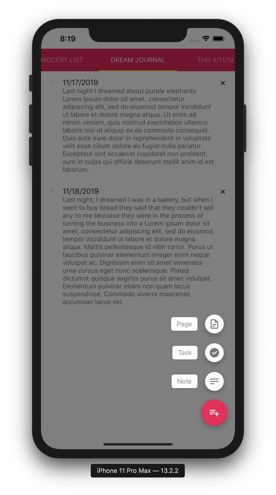
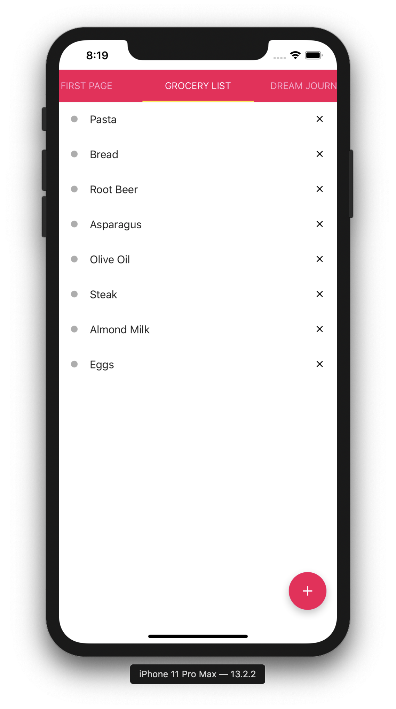
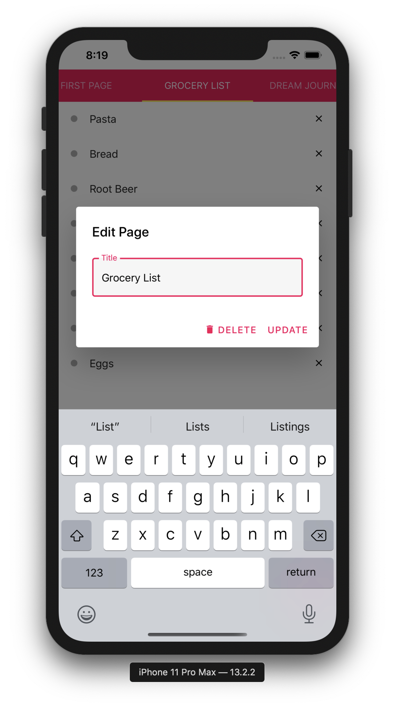

# Simple Bullet Journal
*Features*
* Authentication with password-reset capability
* Cloud database
* Add notes/tasks/pages
* Drag and drop to rearrange notes and tasks
* Swipe between pages
* Tap tasks to mark as complete

  
   
  
  

  
   
  
  

*Stack*
* React Native with Expo
* Firebase for Database and Authentication
* React Native Paper
* Javascript
* Moment.js

